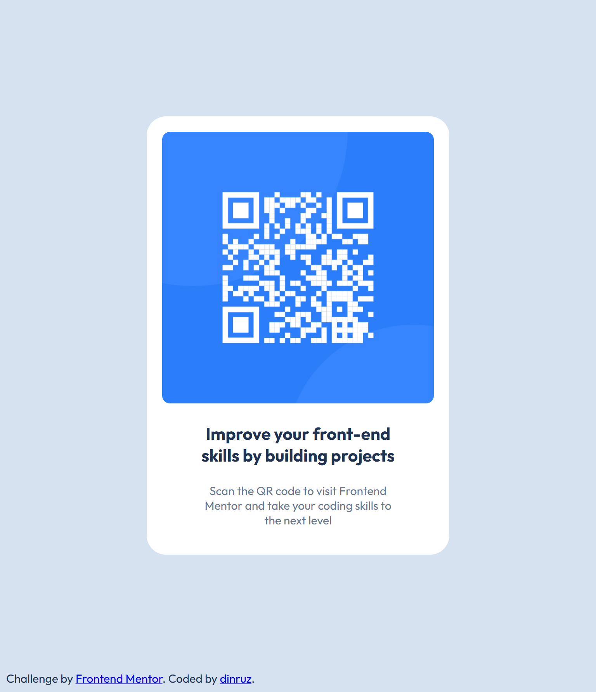

# Frontend Mentor - QR Code Component Solution

This is a solution to the [QR code component challenge on Frontend Mentor](https://www.frontendmentor.io/challenges/qr-code-component-iux_sIO_H). Frontend Mentor challenges help you improve your coding skills by building realistic projects.

## Table of contents
- [Overview](#overview)
  - [Screenshot](#screenshot)
  - [Links](#links)
- [My process](#my-process)
  - [Built with](#built-with)
  - [What I learned](#what-i-learned)
  - [Continued development](#continued-development)
  - [Useful resources](#useful-resources)
- [Author](#author)

## Overview
This is a solution for QR code component based on the provided desktop design.

## Screenshot

## Links

[Watch demo](https://dinruz.github.io/qr-code-component)

[GitHub Repo](https://github.com/dinruz/qr-code-component)

## My process

### Built with

* semantic HTML5 markup
* CSS custom properties
* Flexbox

### What I learned

**Image and Paragraph Alignment/Spacing Issue:** The initial visual misalignment between the image and the text blocks due to the different widths of these blocks, even though I was trying to center them with Flexbox.
Understanding that align-items: center; centers the blocks as a whole, not their internal content if the blocks have different widths, was key.
 
Setting *width: 100%;* on the image helped to fill all available space within the card (after padding), which significantly improved visual alignment with the text.

### Continued development

I plan to improve on these areas:

- **Responsive Design:** use of media queries and fluid units

- **Deeper understanding of Flexbox:** better understanding of already known properties

- **Figma:** navigating tools, extracting infos for CSS etc.

### Useful resources

-[Josh W. Comeau:Interactive Guide To Flexbox](https://www.joshwcomeau.com/css/interactive-guide-to-flexbox/)

## Author

Frontend Mentor - [@dinruz](https://github.com/dinruz)

GitHub - [@dinruz](https://www.frontendmentor.io/profile/dinruz)